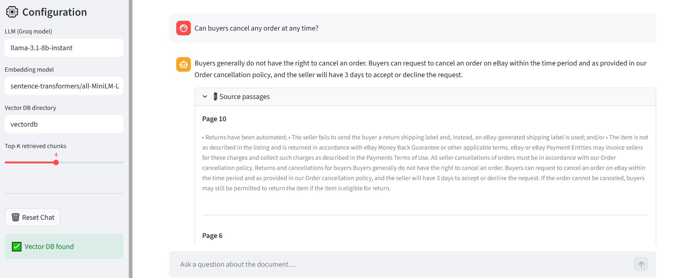
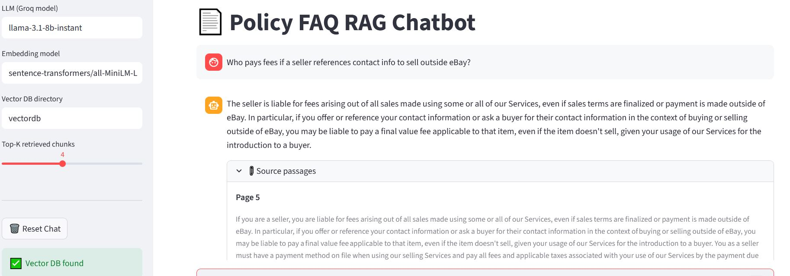
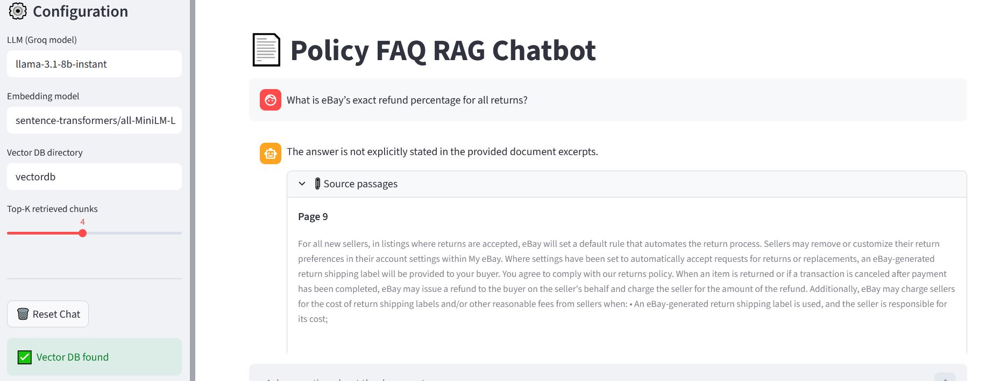
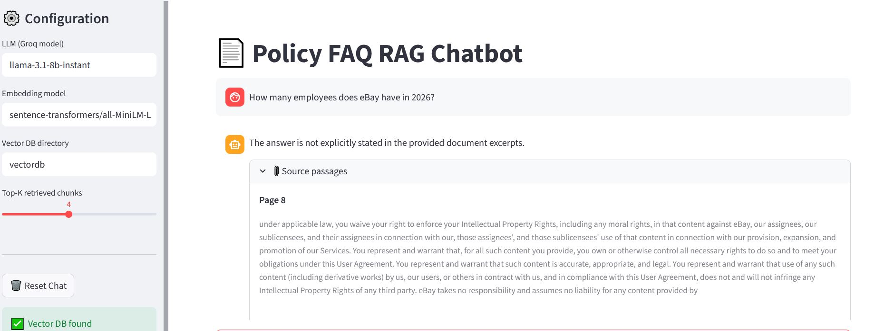
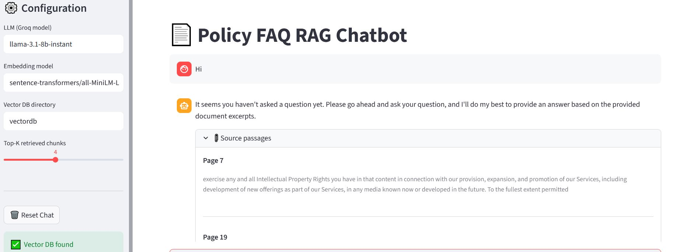

# 📄 Policy FAQ RAG Chatbot

A Retrieval-Augmented Generation (RAG) chatbot for document-based question answering using semantic retrieval, FAISS vector search, and Groq-hosted LLMs. The system ingests policy/legal PDFs and generates grounded answers with source-aware retrieval and real-time streaming responses.

---

# ✨ Features

- 📄 PDF ingestion and preprocessing
- ✂️ Sentence-aware chunking
- 🧠 Semantic search with FAISS
- 🔍 Context-grounded answer generation
- ⚡ Real-time streaming responses
- 📚 Page-level traceability
- 🤖 Groq LLM integration
- 🎨 Streamlit chatbot interface

---

# 🏗️ Project Architecture

## Pipeline Flow

1. **Document Ingestion**  
   The PDF is loaded and processed using LangChain document loaders.

2. **Chunking**  
   Documents are split into smaller semantic chunks using `RecursiveCharacterTextSplitter`.

3. **Embedding Generation**  
   Each chunk is converted into vector embeddings using a sentence-transformer model.

4. **Vector Storage**  
   Embeddings are stored inside a FAISS vector database for efficient similarity search.

5. **Semantic Retrieval**  
   Relevant chunks are retrieved based on user queries.

6. **Answer Generation**  
   A Groq-hosted Llama model generates grounded answers using retrieved context.

7. **Streaming Interface**  
   Streamlit streams responses token-by-token for an interactive chat experience.

---

# 🤖 Models Used

## LLM — `llama-3.1-8b-instant`

- Fast inference
- Supports streaming responses
- Good balance between latency and quality
- Suitable for grounded QA systems

---

## Embedding Model — `sentence-transformers/all-MiniLM-L6-v2`

- Lightweight and fast
- Strong semantic retrieval performance
- Efficient local inference
- Works well with FAISS

---

## Vector Database — FAISS

- Fast similarity search
- Lightweight local deployment
- Efficient indexing and retrieval
- Easy persistence and loading

---

# 🛠️ Installation

```bash
git clone https://github.com/ujjawalsingh10/Policy-FAQ-RAG-chatbot
cd policy-faq-bot

python -m venv venv
venv\Scripts\activate

pip install -r requirements.txt
```

---

# 🔑 Environment Variables

Create a `.env` file:

```env
GROQ_API_KEY=your_groq_api_key_here
```

---

# 📚 Preprocessing and Indexing

## 1. Process and Chunk the PDF

```bash
python -m src.document_processor --pdf data/policy_doc.pdf --out chunks/chunks.jsonl
```

---

## 2. Build Embeddings and FAISS Index

```bash
python -m src.build_index --chunks chunks/chunks.jsonl --out_dir vectordb
```

---

# 🚀 Run the Chatbot

```bash
streamlit run app.py
```

---

# ⚡ Streaming Responses

The chatbot streams responses token-by-token using Streamlit, creating a responsive and interactive user experience.

---

# 🎥 Streaming Demo

<p align="center">
  
</p>

---

# 📌 Example Outputs

## ✅ Successful Retrievals

### Query 1

<p align="center">
  
</p>

---

### Query 2

<p align="center">
  
</p>

---

# ❌ Failure Cases

These examples demonstrate retrieval limitations and ambiguous query behavior.

### Failure Case 1

<p align="center">
  
</p>

---

### Failure Case 2

<p align="center">
  
</p>

---

### Failure Case 3

<p align="center">
  
</p>

---

# 📂 Folder Structure

```text
policy-faq-bot/
├── assets/
├── chunks/
├── data/
├── notebooks/
├── src/
│   ├── build_index.py
│   ├── document_processor.py
│   └── rag_pipeline.py
├── vectordb/
├── app.py
├── requirements.txt
├── README.md
└── .env
```

---

# ⚠️ Current Limitations

- No conversational memory or multi-turn orchestration
- Answers are restricted to retrieved document chunks
- Retrieval quality depends on chunking strategy
- Long or ambiguous queries may reduce retrieval accuracy
- Performance depends on embedding quality and prompt engineering

---

# 🔗 Repository

[Policy FAQ RAG Chatbot](https://github.com/ujjawalsingh10/Policy-FAQ-RAG-chatbot)
